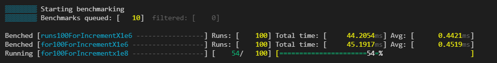
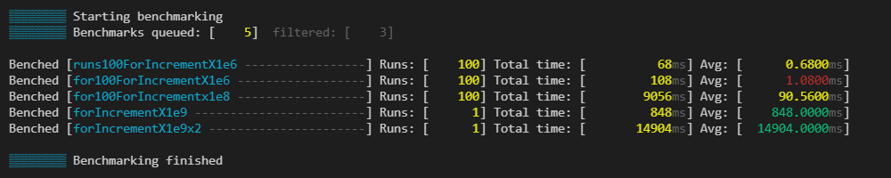
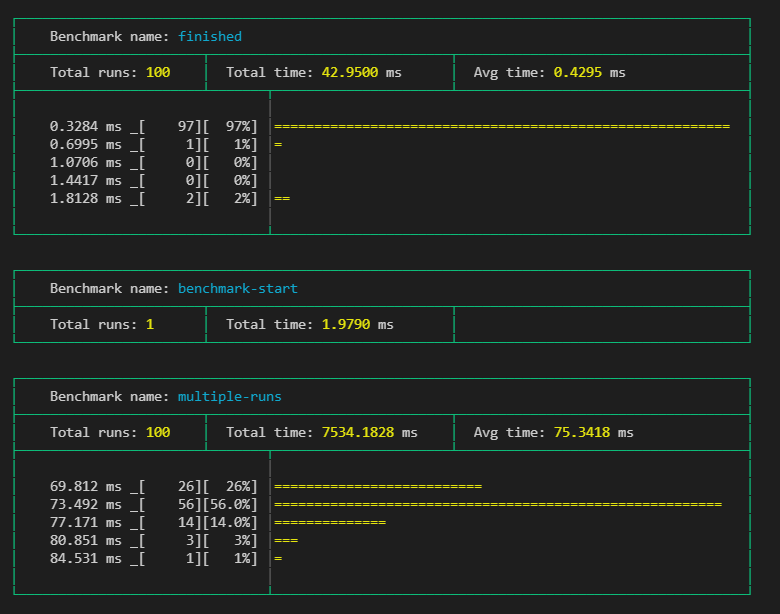
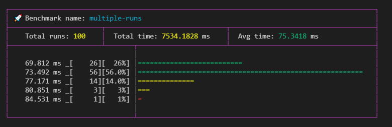
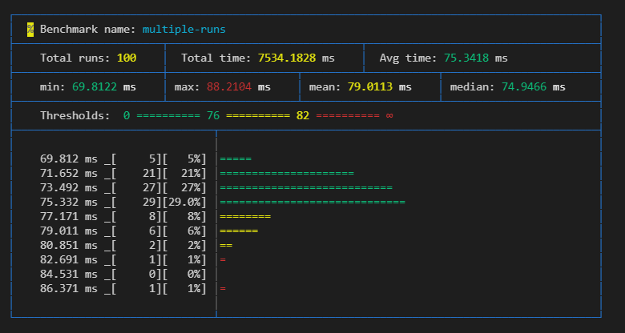
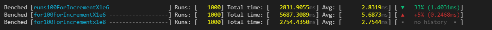
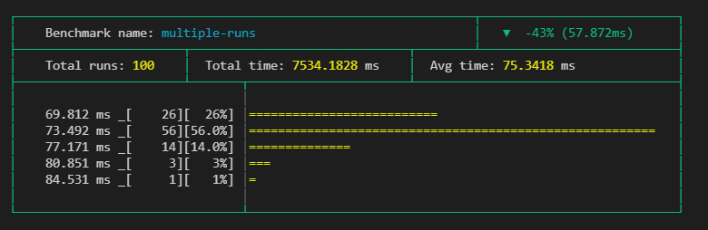

# prettyBenching

A simple Deno library, that gives you pretty benchmarking progress and results in the commandline

[](https://deno.land/x/pretty_benching@v0.3.3)

[](https://github.com/denoland/deno)
[](https://deno.land/std@0.91.0)
[](https://doc.deno.land/https/deno.land/x/pretty_benching/mod.ts)

[](https://github.com/littletof/prettyBenching/actions?query=workflow%3ACI)
[](https://coveralls.io/github/littletof/prettyBenching)

[](https://github.com/littletof/snapper)

## Jump to

- [prettyBenchmarkProgress](#prettybenchmarkprogress)
- [prettyBenchmarkResults](#prettybenchmarkresults)
- [prettyBenchmarkDown](#prettybenchmarkdown) [](#as-a-github-action)
- [prettyBenchmarkHistory](#prettybenchmarkhistory)
- [Roadmap](#roadmap)

## Try it out

This runs a short benchmark to showcase the module live.

```sh
deno run -r --allow-hrtime https://deno.land/x/pretty_benching/example.ts
```

## Getting started

Add the following to your `deps.ts`

```ts
export {
  prettyBenchmarkResult,
  prettyBenchmarkProgress,
  prettyBenchmarkDown,
  prettyBenchingHistory
} from 'https://deno.land/x/pretty_benching@v0.3.3/mod.ts';
```

or just simply import it directly:

```ts
import { prettyBenchmarkResult, prettyBenchmarkProgress, prettyBenchmarkDown, prettyBenchingHistory } from 'https://deno.land/x/pretty_benching@v0.3.3/mod.ts';
```

## Note

Using Deno's `--allow-hrtime` flag when running your code will result in a more precise benchmarking, because than float milliseconds will be used for measurement instead of integer.

You can use `nocolor` in the options of both `prettyBenchmarkProgress` and `prettyBenchmarkResult` to turn off the coloring on the output.
It doesn't interfere with the Deno's `fmt` color settings.

# prettyBenchmarkProgress

Prints the Deno `runBenchmarks()` method's `progressCb` callback values in a nicely readable format.

### Usage

Simply add it to `runBenchmarks()` like below and you are good to go. Using `silent: true` is encouraged, so the default logs don't interfere

```ts
await runBenchmarks({ silent: true }, prettyBenchmarkProgress())
```

The output would look something like this during running:



End when finished:


### Thresholds

You can define thresholds to specific benchmarks and than the times of the runs will be colored respectively

```ts
const thresholds: Thresholds = {
  "for100ForIncrementX1e6": {green: 0.85, yellow: 1},
  "for100ForIncrementX1e8": {green: 84, yellow: 93},
  "forIncrementX1e9": {green: 900, yellow: 800},
  "forIncrementX1e9x2": {green: 15000, yellow: 18000},
}

runBenchmarks({ silent: true }, prettyBenchmarkProgress({thresholds}))
```



### Indicators

You can use indicators, which help you categorise your benchmarks. You can change the character which gets added before the benchmark. 

```ts
const indicators: BenchIndicator[] = [
  { benches: /100/, modFn: colors.bgRed },
  { benches: /for/, modFn: colors.red },
  { benches: /custom/, modFn: () => colors.bgYellow(colors.black("%")) }, // changes indicator char
];
```


# prettyBenchmarkResults

Prints the Deno `runBenchmarks()` method's result in a nicely readable format.

### Usage

Simply call `prettyBenchmarkResult` with the desired settings.

Setting the `nocolor` option to `true` will remove all the built in coloring. Its usefull, if you log it somewhere or save the output to a file. It won't interfere with Deno's `fmt` color settings.

Use the `silent: true` flag in `runBenchmarks`, if you dont want to see the default output

```ts
// ...add benches...

runBenchmarks({silent: true})
.then(prettyBenchmarkResult())
.catch((e: any) => {
  console.error(e.stack);
});
```

The output would look something like this:



### Thresholds

You can define thresholds to specific benchmarks and than related things, like times or graph bars will be colored respectively. This can use the same thresholds object as in `prettyBenchmarkProgress`.

```ts
const thresholds: Thresholds = {
      "multiple-runs": { green: 76, yellow: 82 },
      "benchmark-start": { green: 2, yellow: 3 },
};

runBenchmarks().then(prettyBenchmarkResult({ thresholds }));
```


### Indicators

You can use indicators, which help you categorise your benchmarks besides just their names. You can set what color the table should have. With `modFn` you can also change what color the marker should be, or even change the indicator icon like seen below (default is `#`).
You can pass this object to `prettyBenchmarkProgress` too.

```ts
const indicators: BenchIndicator[] = [
  {
    benches: /multiple-runs/,
    color: colors.magenta,
    modFn: () => "🚀",
  }
];

runBenchmarks().then(prettyBenchmarkResult({ indicators }));
```



### Parts

You can change what the result cards should contain with the `parts` object. Once you define it you have to set all parts you want. The default parts setting is `{ graph: true, graphBars: 5 }`.

You can define what `parts` you want to use in the options, like this:

```ts
prettyBenchmarkResult(
  {
    nocolor: false,
    thresholds,
    indicators,
    parts: {
      extraMetrics: true,
      threshold: true,
      graph: true,
      graphBars: 10,
    },
  },
)
```

Using all options:



##### Extra metrics `{ extraMetrics: true }`

Setting this will give you an extra row, which adds extra calculated values like `min`, `max`, `mean as ((min+max)/2)` , `median`.


##### Threshold `{ threshold: true }`

> Need to have `thresholds` in the root of the `options` object, which have a matching threshold for the specific benchmark, otherwise it wont add it to the specific card.

It simply show what the set thresholds for the benchmark. Can be usefull if `nocolor` is set to true.


##### Graph `{ graph: true, graphBars: 5 }`

Adds a graph, which shows the distribution of the runs of the benchmark.
> Only shows, when there are `10` or more runs set.

The graph shows the results groupped into timeframes, where the groups frame start from the value on the head of its line, and end with excluding the value on the next line.

With `graphBars` you can set how many bars it should show. Default is `5`.

# prettyBenchmarkDown

Generates a summary markdown from the results of the Deno `runBenchmarks()` method's result.

>||Name|Runs|Total (ms)|Average (ms)|Thresholds||
>|:-:|:--|--:|--:|--:|--:|:-:|
>| |Rotating other things|1000|2143.992|2.144|-|-|
>|🎹|Rotating arrays|1000|2021.054|2.021|<small><= 3.5 ✅<br><= 4.4 🔶<br> > 4.4 🔴</small>|✅|
>|%|Proving NP==P|1|4384.908|4384.908|<small><= 4141 ✅<br><= 6000 🔶<br> > 6000 🔴</small>|🔶|
>|🚀|Standing out|1000|375.708|0.376|<small><= 0.3 ✅<br><= 0.33 🔶<br> > 0.33 🔴</small>|🔴|

A full example output: [pr_benchmark_output.md](https://github.com/littletof/prettyBenching/blob/master/docs/prettyBenchmarkDown/pr_benchmark_output.md)

### Usage

Simply call `prettyBenchmarkDown` with the desired settings.

```ts
// ...add benches...

runBenchmarks()
.then(prettyBenchmarkDown(console.log))
.catch((e: any) => {
  console.error(e.stack);
});
```

The first parameter of this function is an output function, where you cen recieve the generated markdown's text. In the example above it just print is to `console`.

Without defining any options, it will generate one `markdown` table with one row for each benchmark.
Something like this:

> |Name|Runs|Total (ms)|Average (ms)|
> |:--|--:|--:|--:|
> |Sorting arrays|4000|1506.683|0.377|
> |Rotating arrays|1000|1935.981|1.936|
> |Proving NP==P|1|4194.431|4194.431|
> |Standing out|1000|369.566|0.370|

##### Writing to a file

```ts
runBenchmarks()
.then(prettyBenchmarkDown(
  (markdown: string) => { Deno.writeTextFileSync("./benchmark.md", markdown); },
  { /* ...options */ }
))
.catch((e: any) => {
  console.error(e.stack);
});
```

> 🔽 Needs *--allow-write* flag to run

### Options

You can fully customise the generated `markdown`. Add text, use predefined, or custom columns or group your benchmarks and define these per group.

Here you can seen an example that showcases every option: [pr_benchmark_output.md](https://github.com/littletof/prettyBenching/blob/master/docs/prettyBenchmarkDown/pr_benchmark_output.md)
It was generated with: [pr_benchmarks.ts](https://github.com/littletof/prettyBenching/blob/master/docs/prettyBenchmarkDown/pr_benchmarks.ts)

#### Extra texts

* `options.title`: Defines a level 1 title (`# MyTitle`) on the top of the generated markdown
* `options.description`: Defines a part, that is put before all of the result tables. If defined as a function, it recieves the `runBenchmarks` result, so it can be set dynamically. It also accepts a simple string as well.
* `options.afterTables`: Defines a part, that is put after all of the result tables. If defined as a function, it recieves the `runBenchmarks` result, so it can be set dynamically. It also accepts a simple string as well.

#### Columns ```options.columns```, ```group.columns```

You can customise, what columns you want to see in each table. To see what every column type generates check out the [<small>example</small>](https://github.com/littletof/prettyBenching/blob/master/docs/prettyBenchmarkDown/pr_benchmark_output.md)

* If `not defined`, the generator uses the default columns defined by the module
* If `defined`, you take full control, of what columns you want to see. The default columns are exported, and there are other premade columns for you to use.

##### defaultColumns(columns: string[]) [<small>example</small>](https://github.com/littletof/prettyBenching/blob/master/docs/prettyBenchmarkDown/pr_benchmark_output.md#default-columns-and-dynamic-text)

```ts
columns: [
  ...defaultColumns(),
  ...defaultColumns(['name', 'measuredRunsAvgMs'])
]
 ```

It includes `Name`, `Runs`, `Total (ms)` and `Average (ms)` columns, these are the default values of the `BenchmarkRunResult`. Filter them with an array of propertyKeys.

##### indicatorColumn(indicators: BenchIndicator[]) [<small>example</small>](https://github.com/littletof/prettyBenching/blob/master/docs/prettyBenchmarkDown/pr_benchmark_output.md#predefiend-columns)

```ts
columns: [
  indicatorColumn(indicators),
]
 ```

Defines a column, that contains the indicator for the given bench, if defined. Keep in mind, that it strips any color from the indicator.

##### thresholdsColumn(thresholds: Thresholds, indicateResult?: boolean) [<small>example</small>](https://github.com/littletof/prettyBenching/blob/master/docs/prettyBenchmarkDown/pr_benchmark_output.md#predefiend-columns)

```ts
columns: [
  thresholdsColumn(thresholds), // only shows the threshold ranges
  thresholdsColumn(thresholds, true), // shows the result in the cell too
]
 ```

Defines a column, that shows the threshold ranges for the given bench, if defined. If you set `indicateResult` to true, it shows in what range the benchmark fell, in the same cell.

##### thresholdResultColumn(thresholds: Thresholds) [<small>example</small>](https://github.com/littletof/prettyBenching/blob/master/docs/prettyBenchmarkDown/pr_benchmark_output.md#predefiend-columns)

```ts
columns: [
  thresholdResultColumn(thresholds),
]
 ```

Defines a column, that show into what threhold range the benchmark fell.

##### extraMetricsColumns(options?) [<small>example</small>](https://github.com/littletof/prettyBenching/blob/master/docs/prettyBenchmarkDown/pr_benchmark_output.md#extra-metrics)

```ts
columns: [
  ...extraMetricsColumns(),
  ...extraMetricsColumns({ ignoreSingleRuns: true }), // puts '-' in cells, where bench was only run once
  ...extraMetricsColumns({ metrics: ["max", "min", "mean", "median", "stdDeviation"] }),
]
 ```

Defines columns, that show extra calculated metrics like `min`, `max`, `mean`, `median`, `stdDeviation`. You can define which of these you want, in the `metrics` array. You can also tell it, to put `-` in the cells, where the benchmark was only run once with `ignoreSingleRuns`.

##### Custom columns [<small>example</small>](https://github.com/littletof/prettyBenching/blob/master/docs/prettyBenchmarkDown/pr_benchmark_output.md#custom-columns)

```ts
columns: [
  {
    title: 'CustomTotal',
    propertyKey: 'totalMs',
    toFixed: 5,
    align: 'left'
  },
  {
    title: 'Formatter',
    formatter: (r: BenchmarkResult, cd: ColumnDefinition) => `${r.name}:${cd.title}`
  },
]
```

When you need something else, you can define you own columns. You can put custom `ColumnDefinitions` into the `columns` array.

* The simplest way, is to give it a `propertyKey`, and than it shows that value of the `BenchmarkResult`. You can use any key here, but you will have to put these values into the results manually. If a `result[propertyKey]` is `undefined`, than it puts a `-` into that cell.
If your returned value is a `number`, than you can use `toFixed` to tell what precision you want to see. (It's ignored if value is not a number)

* If your usecase is more complex, than you can use the `formatter` method, where you get the benchmark result, and you can return any value that you want from that. The predefined column types above use this method as well.

```ts
interface ColumnDefinition {
  title: string;
  propertyKey?: string;
  align?: "left" | "center" | "right";
  toFixed?: number;
  formatter?: (result: BenchmarkResult, columnDef: ColumnDefinition) => string;
}
```

#### Groups ```options.groups```

```ts
groups: [
  {
    include: /array/,
    name: "A group for arrays",
    description: "The array group's description",
    afterTable: (gr: BenchmarkResult[], g: GroupDefinition, rr: BenchmarkRunResult) => `Dynamic ${g.name}, ${gr.length}, ${rr.results.length}`,
    columns: [/* ... */]
  }
]
```

You can group your benches, so they are separated in your generated markdown. For this, you need to define `include` RegExp. Right now, every benchmark, that doesnt fit any group will be put into one table at the bottom, so if you dont want some filter them before manually.

In each group you can define a `name` which will be a level 2 heading (`## Name`) before you group.

You can also define `description` and `afterTable`, which behave the same like the ones in the root of options.

If you want, you can have different columns in each group, if you define them in the groups `columns` array.

```ts
interface GroupDefinition {
  include: RegExp;
  name: string;
  columns?: ColumnDefinition[];
  description?: string | ((groupResults: BenchmarkResult[], group: GroupDefinition,runResults: BenchmarkRunResult ) => string);
  afterTable?: string | ((groupResults: BenchmarkResult[], group: GroupDefinition, runResults: BenchmarkRunResult ) => string);
}
```
  
### As a Github Action

Use this in a github action, eg. comment benchmark results on PRs.

You can see an example Github Action for this [here](https://github.com/littletof/prettyBenching/blob/master/docs/prettyBenchmarkDown/pr_benchmark.yml) or see it in use in a showcase [repo](https://github.com/littletof/pretty-benching-action/pull/2).

# prettyBenchmarkHistory

Helps to keep track of the results of the different `runBenchmarks()` runs historically.

### Usage

> **Note** this module doesn't handle the loading and saving of the data from/to the disk. See examples.

First, if you already have saved historic data, you need to load it from disk (or elsewhere).
If no previous historicData is provided in the constructor, it starts a fresh, empty history.

After it was initiated with the `options` and data, you can simply call `addResults` with the new results, and save them again into a file, using `getDataString()` which returns the historic data in a pretty printed JSON string. If you want to work on the data itself, call `getData()`.

You are able to set some rules in the `options`, like to only allow to add a result, if every benchmark was run a minimum of x times, or if no benchmark was added or removed or had its `runsCount` changed since the previous run.

By default it only allows to add results that were measured with `--allow-hrtime` flag, but this rule can be disabled.

```ts
// add benches, then

let historicData;
try {
    historicData = JSON.parse(Deno.readTextFileSync("./benchmarks/history.json"));
} catch(e) {
  // Decide whether you want to proceed with no history
  console.warn(`⚠ cant read history file. (${e.message})`);
}

const history = new prettyBenchmarkHistory(historicData, {/*options*/});

runBenchmarks().then((results: BenchmarkRunResult) => {
    history.addResults(results {id: "version_tag"});
    Deno.writeTextFileSync("./benchmarks/history.json", history.getDataString());
});
```

The resulting historic data would look something like this, based on the options:

```json
{
  "history": [
    {
      "date": "2020-09-12T20:28:36.812Z",
      "id": "v1.15.2",
      "benchmarks": {
        "RotateArrays": {
          "measuredRunsAvgMs": 0.061707600000003596,
          "runsCount": 500,
          "totalMs": 30.853800000001797,
          "extras": {
            "max": 0.45420000000001437,
            "min": 0.034700000000043474,
            "mean": 0.24445000000002892,
            "median": 0.04179999999996653,
            "std": 0.04731720894389344
          }
        },
        "x3#14": {
          "measuredRunsAvgMs": 2.6682033000000036,
          "runsCount": 1000,
          "totalMs": 2668.2033000000038,
          "extras": {
            "max": 9.25019999999995,
            "min": 1.983299999999872,
...
```

### Rules and options

* **`easeOnlyHrTime`**: Allows storing low precision measurements, which where measured without `--allow-hrtime` flag
* **`strict`**: Contains a set of rules, which are all enforced, if boolean `true` is set, but can be individually controlled if an object is provided:
  
  * **`noRemoval`**:  Throw an error, when previously saved benchmark is missing from the current set when calling `addResults`. Ignored on the very first set of benchmarks.
  * **`noAddition`**: Throw an error, when previously not saved benchmark is added to the current set when calling `addResults`. Ignored on the very first set of benchmarks.
  * **`noRunsCountChange`**: Throw an error, when the `runsCount` changes for a benchmark from the previous run's `runsCount`. Ignored on new benchmarks.

* **`minRequiredRuns`**: Throw an error, when **any** benchmark has lower runsCount than the set value.

* **`saveIndividualRuns`**: Saves the `measuredRunsMs` array for each benchmark.
  **WARNING** this could result in a very big history file overtime.
  Consider calculating necessary values before save instead with `benchExtras` or `runExtras`.
  
* **`benchExtras`**(result: BenchmarkResult) => T : Saves the returned `object` for each benchmark into it's `extras` property.

* **`runExtras`**(runResult: BenchmarkRunResult) => K : Saves the returned `object` for each run into it's `runExtras` property.

### Methods

* **`addResults`**: Stores the run's result into the historic data, enforces all set rules on the results. You can specify an `id` in the options to help identify the specific historic data besides the date. It useful for example to set it to the benchmarked module's version number.

* **`getDeltasFrom`**: Calls `getDeltaForBenchmark` for each benchmark in the provided `BenchmarkRunResults` and returns the values as one object.

* **`getDeltaForBenchmark`**: Calculates `deltas` for given `BenchmarkResult` for each provided property key.

* **`getData`**: Returns a copy of the historic data.

* **`getDataString`**: Returns the historic data in a pretty-printed JSON string.

* **`getBenchmarkNames`**: Returns an array of each benchmark's name, which result is present in the historic data.

### Usecases

* Show `deltas` in the different formats:

  * **`prettyBenchmarkProgress`**: 
  
    <details>
      <summary>code</summary>

      ```ts
      const history = new prettyBenchmarkHistory(historicData, {/*options*/});

      runBenchmarks({ silent: true }, prettyBenchmarkProgress(
        { rowExtras: deltaProgressRowExtra(history) }
      ));
      ```
    </details>

  * **`prettyBenchmarkResults`**:
  
    <details>
      <summary>code</summary>

      ```ts
      const history = new prettyBenchmarkHistory(historicData, {/*options*/});

      runBenchmarks().then(prettyBenchmarkResult(
          { infoCell: deltaResultInfoCell(history) }
      ));
      ```
    </details>
  
  * **`prettyBenchmarkDown`**:
  
    |Name|Average (ms)|Change in average|
    |:-:|:-:|:-:|
    |x3#14|2.8319|🟢   -33% (1.3895ms)|
    |MZ/X|5.6873|🔺   +5% (0.2468ms)|
    |MZ/T|2.7544|-|

    <details>
      <summary>code</summary>

      ```ts
      const history = new prettyBenchmarkHistory(historicData, {/*options*/});

      runBenchmarks().then(prettyBenchmarkDown(console.log, {
        columns: [
            ...defaultColumns(['name', 'measuredRunsAvgMs']),
            deltaColumn(history),
        ]
      }));
      ```
    </details>

* Show each previous measurement as a column in a markdown table
   
  >|Name|2020-09-12<br/>21:54:53.706|v0.5.6|v0.8.0|Current|Change in average|
  >|:-:|--:|--:|--:|:-:|:-:|
  >|historic|0.0704|0.0740|0.0904|0.0650|🟢   -28% (0.0254ms)|
  >|x3#14|6.1675|2.9979|4.2214|3.6275|🟢   -14% (0.5939ms)|
  >|MZ/X|-|3.3095|5.4405|7.4553|🔺  +37% (2.0147ms)|
  >|MZ/T|-|-|-|3.7763|-|

  <details>
    <summary>code</summary>

    ```ts
      const history = new prettyBenchmarkHistory(historicData, {/*options*/});

      runBenchmarks().then(prettyBenchmarkDown(console.log, {
        columns: [
            { title: "Name", propertyKey: "name" },
            ...historyColumns(history),
            { title: "Current", propertyKey: "measuredRunsAvgMs", toFixed: 4 },
            deltaColumn(history),
        ]
      }));
    ```
  </details>

* Calculate thresholds from the previous results: `calculateThresholds` [docs](https://doc.deno.land/https/deno.land/x/pretty_benching/mod.ts#calculateThresholds)
* Github Actions: Save results on version tags, report benchmarking results as a comment on PR-s.
* Fail/warn in CI on a PR if the `delta` is too big or benchmark is in red `threshold` with: `getDeltasFrom` and `getThresholdResultsFrom`

# Roadmap

#### BenchmarkProgress

- [x] Add `indicator` options
- [x] Add `nocolor` option
- [x] Unify `indicator` option types, use `color`
- [x] Add overridable output function like in benchmark results

#### BenchmarkResults

- [x] Overrideable output function
- [x] Refactor outputting result in a single call
- [x] Add `nocolor` option
- [x] Fix graph
- [x] Add `indicator` options like in progress
- [x] Tidy up current benchmark results look
- [x] Add options to define what parts are shown in the result cards. (eg. show graph, more calculated values like mean, ...)
- [ ] Find a place in `extraMetrics` for `standard deviation`.
- [ ] Add option to crop outlayer results from graph (maybe with a percent limit).
- [ ] Add an option to have a minimalist result output, that resembles the final progress output, instead of the big cards.
  
#### Historic data

- [x] Add module to enable historic data save/read inside repo
- [x] Make use of historic module, enable automatic calculating of thresholds from previous runs
- [x] Option to use historic data, to tell if benchmarks got better or worse from previous runs.

#### Operational

- [x] Write README docs
- [x] Separate `prettyBenchmarkResults` and `prettyBenchmarkProgress` into independently importable modules.
- [x] Add the ability to follow the change on how the outputs look like.
- [x] Refactor how optional `options` are handled
- [x] Write JSDocs
- [ ] Proper tests
- [ ] Refactor README
- [ ] Add showcase module, which helps to have consistent docs images
- [ ] Make module contributor friendly
